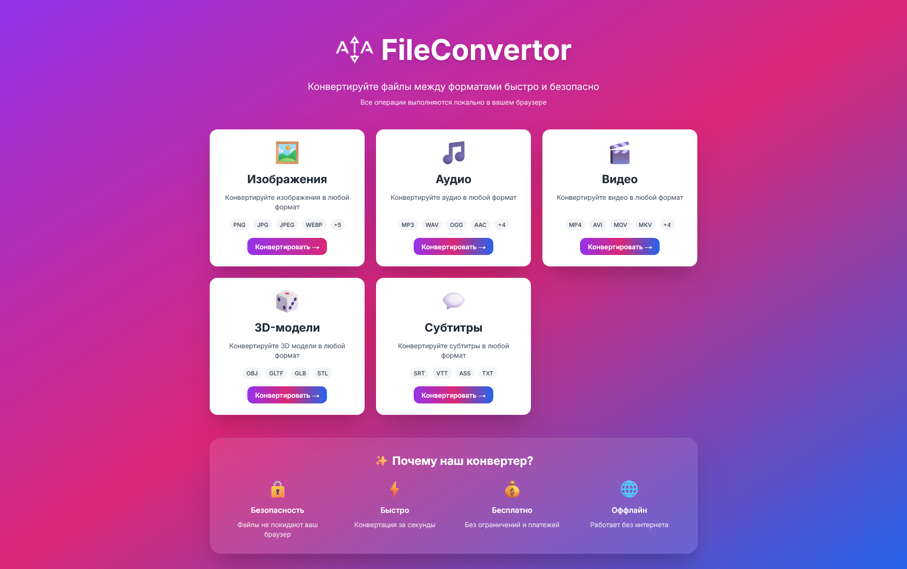
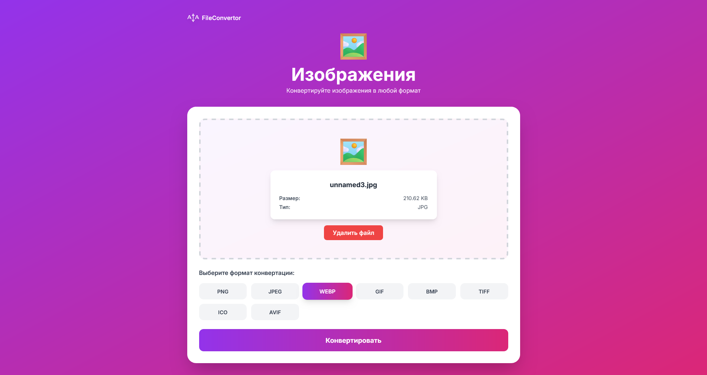

#  ATA FileConvertor

Универсальный конвертер файлов на Next.js с поддержкой 5 категорий форматов.

## 🌐 English version  
[English](./README_en.md)  

## ⛶ Скриншоты




## 🎯 Поддерживаемые категории

### Медиа (FFmpeg)
- 🖼️ **Изображения**: PNG, JPG, JPEG, WEBP, GIF, BMP, TIFF, ICO, AVIF
- 🎵 **Аудио**: MP3, WAV, OGG, AAC, M4A, FLAC, OPUS, WMA
- 🎬 **Видео**: MP4, AVI, MOV, MKV, WEBM, FLV, WMV, MPEG

### Специализированные форматы
- 🎲 **3D-модели**: OBJ, GLTF, GLB, STL
- 💬 **Субтитры**: SRT, VTT, ASS, TXT

## 📦 Установка

```bash
npm install
```

## 🚀 Запуск

```bash
npm run dev
```

Откройте [http://localhost:3000](http://localhost:3000)

## 🎨 Настройка логотипа

Поместите ваш логотип в папку `public/` с именем `logo.png`

```
public/
└── logo.png  (ваш логотип)
```

Рекомендуемый размер: 80x80px для главной страницы, 32x32px для навигации

## 🔧 Используемые технологии

### Конвертация
- **FFmpeg.wasm** - Изображения, аудио, видео
- **Текстовая обработка** - Субтитры
- **JSON парсинг** - 3D модели (базовая структура)

## ✨ Реализованные конвертации

✅ **Изображения** - FFmpeg (все форматы)
✅ **Аудио** - FFmpeg (все форматы)  
✅ **Видео** - FFmpeg (все форматы)
✅ **Субтитры** - SRT ↔ VTT ↔ ASS ↔ TXT
✅ **3D-модели** - OBJ ↔ glTF ↔ STL (базовая конвертация)

## 🎨 Особенности дизайна

- ✅ Логотип и брендинг ATA FileConvertor
- ✅ Белые карточки с уникальными градиентными кнопками
- ✅ Градиентный фон на каждой странице конвертации
- ✅ Центрированный layout для лучшей читаемости
- ✅ Drag & Drop загрузка файлов
- ✅ Предпросмотр загруженного файла
- ✅ Прогресс-бар конвертации
- ✅ Адаптивный дизайн

## 📁 Структура проекта

```
universal-converter/
├── app/
│   ├── [category]/
│   │   └── page.tsx         # Динамические страницы конвертации
│   ├── globals.css          # Глобальные стили
│   ├── layout.tsx           # Корневой layout
│   └── page.tsx             # Главная с категориями
├── components/
│   └── ConverterComponent.tsx  # Логика конвертации
├── lib/
│   └── categories.ts        # Конфигурация категорий
├── public/
│   └── logo.png
|   ├── main_scr.png
|   └──  convert_scr.png
├── package.json
├── tsconfig.json
├── tailwind.config.js
├── postcss.config.js
├── next.config.js
└── README.md
```

## ⚠️ Важные примечания

1. **FFmpeg загружается при первом использовании** медиа (~30 сек)
2. **Видео конвертация** может быть медленной для больших файлов
3. **3D модели** - базовая конвертация структуры
4. **Работает в современных браузерах** (Chrome, Firefox, Edge)
5. **Полностью локально** - файлы не отправляются на сервер

## 🚀 Production build

```bash
npm run build
npm start
```

## 🔮 Возможные улучшения

- [ ] Пакетная конвертация
- [ ] Настройки качества
- [ ] Расширенная конвертация 3D моделей
- [ ] Предпросмотр результата
- [ ] История конвертаций
- [ ] Темная тема

## 📝 Лицензия

MIT

---

**ATA FileConvertor** - Конвертируйте файлы легко и быстро ❤️
