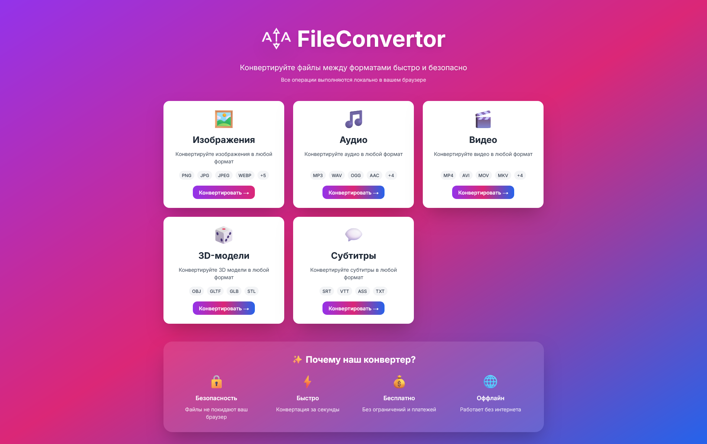
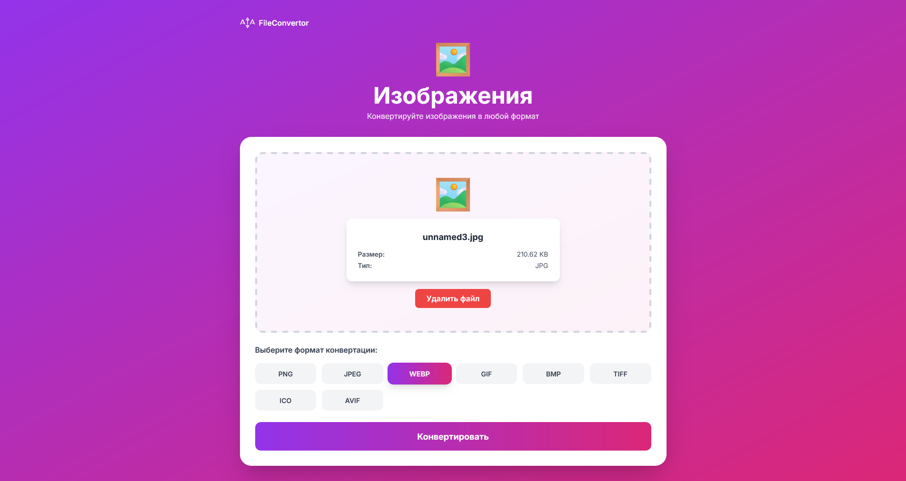

#  ATA FileConvertor

Universal file converter for Next.js with support for 5 format categories.

## 🌐 Russian version  
[Russian](./README.md)  

## ⛶ Screenshots




## 🎯 Supported categories

### Media (FFmpeg)
- 🖼️**Images**: PNG, JPG, JPEG, WEBP, GIF, BMP, TIFF, ICO, AVI
- 🎵 **Audio**: MP3, WAV, OGG, AAC, M4A, FLAC, OPUS, WMA
- 🎬 **Videos**: MP4, AVI, MOV, MKV, WEBM, FLV, WMV, MPEG

### Specialized formats
- 🎲 **3D models**: OBJ, GLTF, GLB, STL
- 💬 **Subtitles**: SRT, VTT, ASS, TXT

## , Installation

```bash
npm install
```

## 🚀 Launch

```bash
npm run dev
```

Open it [http://localhost:3000 ](http://localhost:3000 )

## 🎨 Logo Setup

Place your logo in the `public/` folder named `logo.svg`

``
public/
└── logo.svg (your logo)
``

Recommended size: 80x80px for the main page, 32x32px for navigation

## 🔧 Technologies used

### Conversion
- **FFmpeg.wasm** - Images, Audio, Video
- **Text processing** - Subtitles
- **JSON parsing** - 3D models (basic structure)

## ✨ Implemented conversions

✅ **Images** - FFmpeg (all formats)
✅ **Audio** - FFmpeg (all formats)  
✅ **Video** - FFmpeg (all formats)
✅ **Subtitles** - SRT ↔ VTT ↔ ASS ↔ TXT
✅ **3D models** - OBJ ↔ glTF ↔ STL (basic conversion)

## 🎨 Design Features

 ATA FileConvertor logo and branding
- White cards with unique gradient buttons
- ✅ Gradient background on each conversion page
- Centered layout for better readability
- Drag & Drop file upload
- Preview of the uploaded file
- ✅ Conversion progress bar
- ✅ Adaptive design

## 📁 Project structure

```
universal-converter/
├── app/
│   ├── [category]/
│   │   └── page.tsx # Dynamic Conversion Pages
,── globals.css # Global styles
│   ├── layout.tsx # Root layout
│   └── page.tsx # Home with Categories
├── components/
,── ConverterComponent.tsx # Conversion logic
├── lib/
│   └── categories.ts # Configuration of 5 categories
├── public/
,── logo.svg # ATA FileConvertor logo
├── package.json
├── tsconfig.json
├── tailwind.config.js
├── postcss.config.js
├── next.config.js
└── README.md
```

## ⚠️ Important notes

1. **FFmpeg loads the first time you use** media (~30 sec)
2. **Video conversion** can be slow for large files
3. **3D Models** - Basic structure conversion
4. **Works in modern browsers** (Chrome, Firefox, Edge)
5. **Completely local** - files are not sent to the server

## 🚀 Production build

```bash
npm run build
npm start
```

## 🔮 Possible improvements

- [ ] Batch conversion
- [ ] Quality Settings
- [ ] Advanced 3D model conversion
- [ ] Preview of the result
- [ ] Conversion history
- [ ] Dark theme

## 📝 License

MIT

---

*ATA FileConvertor** - Convert files easily and quickly. ❤️